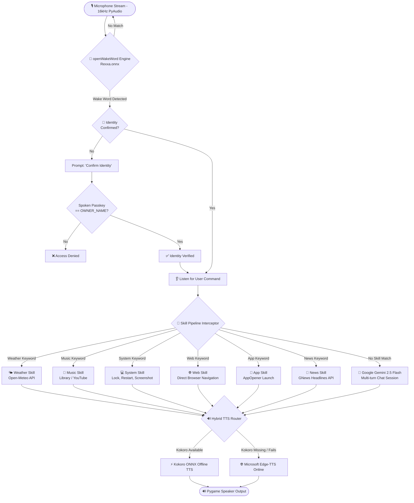

<div align="center">

# 🎙️ REXA — Custom AI Voice Assistant

<p align="center">
  <strong>A private-first, intelligent personal voice assistant combining offline wake-word detection, voice identity authorization, modular desktop skills, and Google Gemini AI.</strong>
</p>

<p align="center">
  <a href="https://www.python.org/downloads/"></a>
  <a href="https://ai.google.dev/"></a>
  <a href="https://github.com/dscripka/openWakeWord"></a>
  <a href="https://github.com/thewh1teagle/kokoro-onnx"></a>
  <a href="LICENSE"></a>
</p>

<p align="center">
  <a href="#-key-features">Key Features</a> •
  <a href="#-system-architecture">Architecture</a> •
  <a href="#-quick-start">Quick Start</a> •
  <a href="#-voice-skills--commands">Voice Skills</a> •
  <a href="#-customization">Customization</a> •
  <a href="#-troubleshooting">Troubleshooting</a>
</p>

---

</div>

## 🌟 Overview

**Rexa** is an advanced personal voice assistant built with a **hybrid local/cloud architecture**. Unlike traditional assistants that continuously stream ambient room audio to remote servers, Rexa listens entirely **offline** for its custom-trained wake word (*"Rexxa"*). Once awakened, it verifies the speaker's identity using a voice authorization passkey, intercepts task-specific commands through a modular local skill pipeline, and falls back to **Google's Gemini 2.5 Flash** for deep conversational intelligence.

---

## 🚀 Key Features

* ⚡ **100% Offline Custom Wake Word Detection**
  * Powered by **`openWakeWord`** and ONNX Runtime.
  * Custom neural wake word model (`Rexxa.onnx`) running continuously with near-zero latency, minimal CPU usage, and zero internet overhead.
* 🔐 **Voice Identity Security Gate**
  * Built-in biometric voice authentication step.
  * Prompts for identity verification before unlocking executive system commands and assistant access.
* 🧩 **Modular Interceptor Skill Engine**
  * Spoken commands are evaluated against an extensible rule-based skill pipeline.
  * Local actions (system control, weather, media, app launching, news, web browsing) execute in milliseconds without calling remote LLMs.
* 🧠 **Conversational Intelligence (Gemini 2.5 Flash)**
  * Integrated with Google's state-of-the-art **Gemini 2.5 Flash** model.
  * Multi-turn conversational memory, witty custom personality, concise plain-text speech optimization, and bilingual understanding (**English & Urdu**).
* 🔊 **Fail-Safe Hybrid Text-to-Speech (TTS)**
  * **Primary (Offline)**: Neural high-fidelity voice synthesis powered by **Kokoro ONNX** (`bf_emma`).
  * **Fallback (Online)**: Instant, seamless failover to **Microsoft Edge-TTS** (`en-US-MichelleNeural`) ensuring voice output is always available.
* 💻 **Desktop & Workspace Automation**
  * Control Windows workstations (shutdown, restart, lock screen, take full-screen screenshots).
  * Launch any installed Windows application by voice using fuzzy app resolution (`AppOpener`).

---

## 🏗️ System Architecture



---

## 🛠️ Technology Stack

| Domain | Technology / Library | Purpose |
| :--- | :--- | :--- |
| **Core Runtime** | Python 3.10+ | Primary language & ecosystem |
| **Wake Word Engine** | [`openWakeWord`](https://github.com/dscripka/openWakeWord), ONNX Runtime | Low-latency local wake-word inference (`Rexxa.onnx`) |
| **Speech-to-Text (STT)** | [`SpeechRecognition`](https://pypi.org/project/SpeechRecognition/) (Google STT) | Accurate voice-to-text conversion |
| **Primary TTS (Offline)** | [`kokoro-onnx`](https://github.com/thewh1teagle/kokoro-onnx) | Offline neural voice generation (`bf_emma`) |
| **Fallback TTS (Online)** | [`edge-tts`](https://github.com/rany2/edge-tts) | High-speed cloud voice fallback (`en-US-MichelleNeural`) |
| **LLM Intelligence** | [`google-generativeai`](https://pypi.org/project/google-generativeai/) (`gemini-2.5-flash`) | Witty conversational brain, bilingual QA |
| **System Automation** | [`AppOpener`](https://pypi.org/project/AppOpener/), `PyAutoGUI` | Application launching, desktop controls & screenshots |
| **Audio I/O** | `PyAudio`, `pygame.mixer`, `soundfile` | Microphone streaming & audio playback |

---

## 📂 Repository Structure

```plaintext
Rexa-Voice-Assistant/
├── Skills/                      # Modular Skill Extensions
│   ├── __init__.py
│   ├── rules.py                 # Abstract Base Class (Skill interface)
│   ├── apps.py                  # Desktop application launcher (AppOpener)
│   ├── musicLibrary.py          # Curated song bookmarks & YouTube links
│   ├── news.py                  # Live global news headlines (GNews API)
│   ├── song.py                  # Smart music player & YouTube search
│   ├── system.py                # OS management (Lock, Screenshot, Shutdown)
│   ├── weather.py               # Live forecasts with memory (Open-Meteo)
│   └── web.py                   # One-shot web portal navigation
├── .env.example                 # Environment configuration template
├── .gitignore                   # Optimized ignore rules (secrets, venvs, binaries)
├── main.py                      # Main event loop, wake word listener & TTS router
├── requirements.txt             # Project dependencies (UTF-8)
├── Rexxa.onnx                   # Custom trained openWakeWord model for "Rexxa"
├── voices-v1.0.bin              # Kokoro TTS voice embeddings
└── README.md                    # Project documentation
```

---

## ⚡ Quick Start

### 1. Prerequisites

* **Python 3.10 or higher** installed on your system.
* A working **Microphone** and **Speakers/Headphones**.
* A free **Google Gemini API Key** from [Google AI Studio](https://aistudio.google.com/app/apikey).

### 2. Clone the Repository

```bash
git clone https://github.com/Gulshaheer-AI/Rexa-Voice-Assistant.git
cd Rexa-Voice-Assistant
```

### 3. Create a Virtual Environment

* **Windows (PowerShell)**:
  ```powershell
  python -m venv venv
  .\venv\Scripts\activate
  ```

* **Linux / macOS**:
  ```bash
  python3 -m venv venv
  source venv/bin/activate
  ```

### 4. Install Dependencies

```bash
pip install -r requirements.txt
```

> **Note for Windows Users**: If `pyaudio` fails to compile, install the prebuilt wheel with `pip install pipwin && pipwin install pyaudio`, or install [Microsoft C++ Build Tools](https://visualstudio.microsoft.com/visual-cpp-build-tools/).

### 5. Configure Environment Variables

Create your `.env` file from the provided template:

```bash
# Windows
copy .env.example .env

# Linux / macOS
cp .env.example .env
```

Open `.env` and fill in your keys:

```env
# Google Gemini API Key (Required for conversation)
Gemini_KEY="AIzaSyYourGeminiApiKeyHere"

# Voice Authorization Passkey (Default: shaheer)
OWNER_NAME="shaheer"

# Optional: GNews API Key (Default fallback included)
GNEWS_API_KEY="your_gnews_api_key_here"
```

### 6. (Optional) Setup Kokoro Offline TTS

Rexa already includes the `voices-v1.0.bin` embeddings in the repository. To enable 100% offline Kokoro TTS:

1. Download `kokoro.onnx` from the [Kokoro ONNX Releases](https://github.com/thewh1teagle/kokoro-onnx/releases) (or HuggingFace).
2. Place `kokoro.onnx` directly into the project root folder:
   ```plaintext
   Rexa-Voice-Assistant/kokoro.onnx
   ```
> If `kokoro.onnx` is not present, Rexa will automatically and seamlessly use **Microsoft Edge-TTS** online!

### 7. Run Rexa

```bash
python main.py
```

---

## 🎙️ Voice Skills & Commands

Rexa supports an extensive array of commands out-of-the-box:

| Category | Example Voice Commands | Action Performed |
| :--- | :--- | :--- |
| **Activation** | *"Rexxa"* | Triggers wake word listener; prompts for voice identity. |
| **Authentication** | *"Shaheer"* (or your configured `OWNER_NAME`) | Confirms identity and unlocks full assistant capabilities. |
| **Weather** | *"What's the weather?"*<br>*"What is the weather in London?"* | Fetches temperature and sky conditions via Open-Meteo; remembers the last queried city. |
| **Music & Songs** | *"Play Faded"*<br>*"Play Bohemian Rhapsody"* | Plays song from local `musicLibrary` or dynamically searches & launches YouTube. |
| **Desktop Apps** | *"Open Notepad"*<br>*"Open Chrome"*<br>*"Open Spotify"* | Resolves and opens the closest matching Windows application. |
| **Web Portals** | *"Open Google"*<br>*"Open YouTube"*<br>*"Open ChatGPT"*<br>*"Open WhatsApp"*<br>*"Open Gemini"* | Launches target web platform in your default browser. |
| **System Controls** | *"Take screenshot"*<br>*"Lock workstation"*<br>*"Restart"*<br>*"Shutdown"* | Captures screen to `Pictures/rexa_screenshot.png`, locks Windows, or reboots/powers down. |
| **News** | *"Tell me the news"*<br>*"Give me today's headlines"* | Fetches and reads out the top 5 global headlines via GNews API. |
| **Conversational AI** | *"Explain quantum mechanics simply"*<br>*"How do rockets work?"*<br>*"Aap kaise hain?"* (Urdu support) | Routes to Gemini 2.5 Flash with concise, markdown-free conversational responses. |
| **Sleep / Exit** | *"Stop Rexa"*<br>*"Go to sleep"* | Says goodbye and safely shuts down the assistant process. |

---

## ⚙️ Customization

### Adding a Custom Skill

Rexa's architecture uses an interceptor pattern based on `Skills.rules.Skill`. You can add new skills in minutes:

1. Create a new file in `Skills/` (e.g., `Skills/crypto.py`):
   ```python
   from .rules import Skill
   import requests

   class CryptoSkill(Skill):
       def matches(self, command: str) -> bool:
           return "bitcoin" in command.lower() or "crypto" in command.lower()

       def execute(self, command: str, speak_func):
           data = requests.get("https://api.coindesk.com/v1/bpi/currentprice.json").json()
           rate = data["bpi"]["USD"]["rate"]
           speak_func(f"The current price of Bitcoin is {rate} US dollars.")
   ```

2. Register your skill in `main.py`:
   ```python
   from Skills.crypto import CryptoSkill

   skills = [
       Weatherskill(),
       Songskill(),
       Systemskill(),
       Newsskill(),
       Webskill(),
       Appskill(),
       CryptoSkill(), # <-- Add your skill here
   ]
   ```

### Customizing Music Tracks

Edit [Skills/musicLibrary.py](Skills/musicLibrary.py) to add your favorite songs or playlists:

```python
music = {
    "faded": "https://www.youtube.com/watch?v=60ItHLz5WEA",
    "mortals": "https://www.youtube.com/watch?v=meYF7XgBrcg",
    "lofi": "https://www.youtube.com/watch?v=jfKfPfyJRdk",
}
```

---

## 🔧 Troubleshooting

<details>
<summary><strong>1. Wake Word is not triggering</strong></summary>

* Check that your microphone is set as the default recording device in your OS sound settings.
* Adjust `DETECTION_THRESHOLD = 0.5` in [main.py](main.py) (lower values like `0.35` increase sensitivity, higher values like `0.65` require clearer pronunciation).
* Speak clearly into the microphone: *"Rexxa"*.
</details>

<details>
<summary><strong>2. PyAudio Installation Errors (Windows)</strong></summary>

If you receive a compiler error when installing `PyAudio`:
```bash
pip install pipwin
pipwin install pyaudio
```
Alternatively, download the `.whl` corresponding to your Python version from [Gohlke Wheels](https://github.com/cgohlke/win_python_wheels) and install via `pip install <filename>.whl`.
</details>

<details>
<summary><strong>3. Kokoro TTS Warning on Startup</strong></summary>

If you see `[WARNING] Could not load Kokoro TTS: ...`, Rexa will automatically route speech synthesis to Microsoft Edge-TTS online. To use offline synthesis, download `kokoro.onnx` and place it in the project root.
</details>

<details>
<summary><strong>4. Gemini API Error or Missing Key</strong></summary>

Ensure your `.env` file contains a valid `Gemini_KEY`. Verify that the variable name matches `Gemini_KEY` or `GEMINI_API_KEY`.
</details>

---

## 🤝 Contributing

Contributions are welcome! If you'd like to add new skills, optimize audio models, or enhance language support:

1. **Fork** the repository.
2. Create your feature branch (`git checkout -b feature/awesome-skill`).
3. Commit your changes (`git commit -m 'Add awesome skill'`).
4. Push to the branch (`git push origin feature/awesome-skill`).
5. Open a **Pull Request**.

---

## 📄 License

This project is licensed under the [MIT License](LICENSE).

---

<div align="center">
  <sub>Built with ❤️ by <a href="https://github.com/Gulshaheer-AI">Gulshaheer</a> • Powered by openWakeWord & Google Gemini</sub>
</div>
